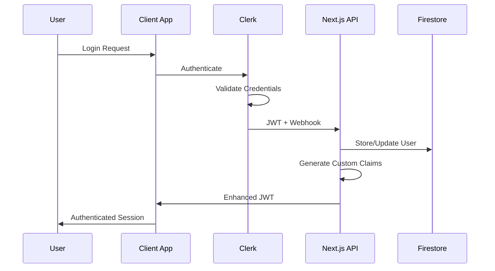

# Security Architecture - AI Marketplace Platform

## Executive Summary

This document outlines the comprehensive security architecture for the AI Marketplace Platform, designed to meet enterprise-grade security requirements including GDPR, HIPAA, and SOC 2 Type II compliance. The architecture implements defense-in-depth principles with multiple layers of security controls across authentication, authorization, data protection, and monitoring.

### Security Objectives
- **Zero-Trust Architecture:** Verify every request and user identity
- **Multi-Tenant Security:** Complete data isolation between organizations
- **Compliance Ready:** Built-in controls for GDPR, HIPAA, and SOC 2
- **Threat Prevention:** Proactive security measures against common attacks
- **Audit Trail:** Comprehensive logging for compliance and forensics

### Security Framework
- **Authentication:** Clerk with custom RBAC implementation
- **Data Protection:** End-to-end encryption and secure storage
- **Network Security:** API rate limiting, DDoS protection, and secure communications
- **Application Security:** Input validation, XSS protection, and secure coding practices
- **Monitoring:** Real-time threat detection and incident response

## Authentication Architecture

### Clerk Integration with Custom RBAC

#### Authentication Flow


#### Custom Claims Implementation
```typescript
// lib/auth/custom-claims.ts
import { clerkClient } from '@clerk/nextjs';
import type { User } from '@clerk/nextjs/server';

interface CustomClaims {
  organizationId: string;
  organizations: string[];
  permissions: string[];
  role: string;
  verificationLevel: 'basic' | 'enhanced' | 'premium';
  lastPermissionUpdate: string;
}

export async function updateUserClaims(userId: string): Promise<void> {
  try {
    const user = await clerkClient.users.getUser(userId);
    const organizationMemberships = await clerkClient.users.getOrganizationMembershipList({
      userId,
    });

    const customClaims: CustomClaims = {
      organizationId: organizationMemberships[0]?.organization.id || '',
      organizations: organizationMemberships.map(m => m.organization.id),
      permissions: await getUserPermissions(userId),
      role: await getUserPrimaryRole(userId),
      verificationLevel: await getUserVerificationLevel(userId),
      lastPermissionUpdate: new Date().toISOString(),
    };

    await clerkClient.users.updateUser(userId, {
      publicMetadata: customClaims,
    });
  } catch (error) {
    console.error('Failed to update user claims:', error);
    throw error;
  }
}

async function getUserPermissions(userId: string): Promise<string[]> {
  // Fetch user permissions from Firestore
  const userDoc = await db.collection('users').doc(userId).get();
  const userData = userDoc.data();
  
  if (!userData) return [];
  
  const permissions = new Set<string>();
  
  // Collect permissions from all organization memberships
  for (const orgMembership of userData.organizations || []) {
    const memberDoc = await db
      .collection('organizations')
      .doc(orgMembership.organizationId)
      .collection('members')
      .doc(userId)
      .get();
    
    const memberData = memberDoc.data();
    if (memberData?.permissions) {
      memberData.permissions.forEach((permission: string) => {
        permissions.add(permission);
      });
    }
  }
  
  return Array.from(permissions);
}
```

### Role-Based Access Control (RBAC)

#### Permission System
```typescript
// lib/auth/permissions.ts
export const PERMISSIONS = {
  // Organization Management
  ORG_READ: 'org:read',
  ORG_WRITE: 'org:write',
  ORG_DELETE: 'org:delete',
  ORG_ADMIN: 'org:admin',
  
  // User Management
  USER_INVITE: 'user:invite',
  USER_MANAGE: 'user:manage',
  USER_DELETE: 'user:delete',
  
  // Service Management
  SERVICE_CREATE: 'service:create',
  SERVICE_READ: 'service:read',
  SERVICE_UPDATE: 'service:update',
  SERVICE_DELETE: 'service:delete',
  SERVICE_PUBLISH: 'service:publish',
  
  // Booking Management
  BOOKING_CREATE: 'booking:create',
  BOOKING_READ: 'booking:read',
  BOOKING_UPDATE: 'booking:update',
  BOOKING_DELETE: 'booking:delete',
  
  // Analytics
  ANALYTICS_READ: 'analytics:read',
  ANALYTICS_EXPORT: 'analytics:export',
  
  // System Administration
  ADMIN_SYSTEM: 'admin:system',
  ADMIN_AUDIT: 'admin:audit',
  ADMIN_USERS: 'admin:users',
} as const;

export type Permission = typeof PERMISSIONS[keyof typeof PERMISSIONS];

// Role Definitions
export const ROLES = {
  // Organization Roles
  ORG_OWNER: {
    id: 'org_owner',
    name: 'Organization Owner',
    permissions: [
      PERMISSIONS.ORG_READ,
      PERMISSIONS.ORG_WRITE,
      PERMISSIONS.ORG_ADMIN,
      PERMISSIONS.USER_INVITE,
      PERMISSIONS.USER_MANAGE,
      PERMISSIONS.SERVICE_CREATE,
      PERMISSIONS.SERVICE_READ,
      PERMISSIONS.SERVICE_UPDATE,
      PERMISSIONS.SERVICE_DELETE,
      PERMISSIONS.SERVICE_PUBLISH,
      PERMISSIONS.BOOKING_CREATE,
      PERMISSIONS.BOOKING_READ,
      PERMISSIONS.BOOKING_UPDATE,
      PERMISSIONS.ANALYTICS_READ,
      PERMISSIONS.ANALYTICS_EXPORT,
    ],
  },
  
  ORG_ADMIN: {
    id: 'org_admin',
    name: 'Organization Administrator',
    permissions: [
      PERMISSIONS.ORG_READ,
      PERMISSIONS.ORG_WRITE,
      PERMISSIONS.USER_INVITE,
      PERMISSIONS.USER_MANAGE,
      PERMISSIONS.SERVICE_CREATE,
      PERMISSIONS.SERVICE_READ,
      PERMISSIONS.SERVICE_UPDATE,
      PERMISSIONS.SERVICE_PUBLISH,
      PERMISSIONS.BOOKING_CREATE,
      PERMISSIONS.BOOKING_READ,
      PERMISSIONS.BOOKING_UPDATE,
      PERMISSIONS.ANALYTICS_READ,
    ],
  },
  
  // Provider Roles
  PROVIDER_ADMIN: {
    id: 'provider_admin',
    name: 'Provider Administrator',
    permissions: [
      PERMISSIONS.ORG_READ,
      PERMISSIONS.ORG_WRITE,
      PERMISSIONS.USER_INVITE,
      PERMISSIONS.USER_MANAGE,
      PERMISSIONS.SERVICE_CREATE,
      PERMISSIONS.SERVICE_READ,
      PERMISSIONS.SERVICE_UPDATE,
      PERMISSIONS.SERVICE_DELETE,
      PERMISSIONS.SERVICE_PUBLISH,
      PERMISSIONS.BOOKING_READ,
      PERMISSIONS.BOOKING_UPDATE,
      PERMISSIONS.ANALYTICS_READ,
    ],
  },
  
  // Member Roles
  TEAM_MEMBER: {
    id: 'team_member',
    name: 'Team Member',
    permissions: [
      PERMISSIONS.ORG_READ,
      PERMISSIONS.SERVICE_READ,
      PERMISSIONS.BOOKING_CREATE,
      PERMISSIONS.BOOKING_READ,
      PERMISSIONS.BOOKING_UPDATE,
    ],
  },
  
  // Viewer Role
  VIEWER: {
    id: 'viewer',
    name: 'Viewer',
    permissions: [
      PERMISSIONS.ORG_READ,
      PERMISSIONS.SERVICE_READ,
      PERMISSIONS.BOOKING_READ,
    ],
  },
} as const;

// Permission Checking Utilities
export function hasPermission(userPermissions: string[], requiredPermission: Permission): boolean {
  return userPermissions.includes(requiredPermission);
}

export function hasAnyPermission(userPermissions: string[], requiredPermissions: Permission[]): boolean {
  return requiredPermissions.some(permission => userPermissions.includes(permission));
}

export function hasAllPermissions(userPermissions: string[], requiredPermissions: Permission[]): boolean {
  return requiredPermissions.every(permission => userPermissions.includes(permission));
}

// React Hook for Permission Checking
export function usePermissions() {
  const { user } = useAuth();
  const userPermissions = (user?.publicMetadata?.permissions as string[]) || [];
  
  return {
    hasPermission: (permission: Permission) => hasPermission(userPermissions, permission),
    hasAnyPermission: (permissions: Permission[]) => hasAnyPermission(userPermissions, permissions),
    hasAllPermissions: (permissions: Permission[]) => hasAllPermissions(userPermissions, permissions),
    permissions: userPermissions,
  };
}
```

#### API Route Protection
```typescript
// lib/auth/middleware.ts
import { auth } from '@clerk/nextjs';
import { NextRequest, NextResponse } from 'next/server';
import type { Permission } from './permissions';

export function withAuth(
  handler: (req: NextRequest, context: AuthContext) => Promise<NextResponse>
) {
  return async (req: NextRequest, context: any) => {
    const { userId } = auth();
    
    if (!userId) {
      return NextResponse.json(
        { success: false, error: { code: 'UNAUTHORIZED', message: 'Authentication required' } },
        { status: 401 }
      );
    }
    
    const authContext: AuthContext = {
      userId,
      ...context,
    };
    
    return handler(req, authContext);
  };
}

export function withPermission(requiredPermission: Permission) {
  return function (
    handler: (req: NextRequest, context: AuthContext) => Promise<NextResponse>
  ) {
    return withAuth(async (req: NextRequest, context: AuthContext) => {
      const { user } = await clerkClient.users.getUser(context.userId);
      const userPermissions = (user.publicMetadata?.permissions as string[]) || [];
      
      if (!hasPermission(userPermissions, requiredPermission)) {
        return NextResponse.json(
          { 
            success: false, 
            error: { 
              code: 'FORBIDDEN', 
              message: `Insufficient permissions: ${requiredPermission} required` 
            } 
          },
          { status: 403 }
        );
      }
      
      return handler(req, context);
    });
  };
}

export function withOrganizationAccess(
  handler: (req: NextRequest, context: AuthContext & OrgContext) => Promise<NextResponse>
) {
  return withAuth(async (req: NextRequest, context: AuthContext) => {
    const organizationId = req.headers.get('X-Organization-ID');
    
    if (!organizationId) {
      return NextResponse.json(
        { success: false, error: { code: 'BAD_REQUEST', message: 'Organization ID required' } },
        { status: 400 }
      );
    }
    
    // Verify user has access to this organization
    const { user } = await clerkClient.users.getUser(context.userId);
    const userOrganizations = (user.publicMetadata?.organizations as string[]) || [];
    
    if (!userOrganizations.includes(organizationId)) {
      return NextResponse.json(
        { success: false, error: { code: 'FORBIDDEN', message: 'Access denied to organization' } },
        { status: 403 }
      );
    }
    
    const orgContext: AuthContext & OrgContext = {
      ...context,
      organizationId,
    };
    
    return handler(req, orgContext);
  });
}

interface AuthContext {
  userId: string;
}

interface OrgContext {
  organizationId: string;
}

// Usage Example
// app/api/services/route.ts
export const POST = withPermission(PERMISSIONS.SERVICE_CREATE)(
  withOrganizationAccess(async (req, { userId, organizationId }) => {
    const body = await req.json();
    
    // Create service logic here
    const service = await createService({
      ...body,
      providerId: organizationId,
      createdBy: userId,
    });
    
    return NextResponse.json({ success: true, data: service });
  })
);
```

## Data Protection and Encryption

### Encryption Strategy

#### Encryption at Rest
```typescript
// lib/security/encryption.ts
import { randomBytes, createCipher, createDecipher, pbkdf2Sync } from 'crypto';

class EncryptionService {
  private readonly algorithm = 'aes-256-gcm';
  private readonly keyLength = 32;
  private readonly ivLength = 16;
  private readonly tagLength = 16;
  
  private getEncryptionKey(password?: string): Buffer {
    const masterKey = process.env.ENCRYPTION_MASTER_KEY;
    if (!masterKey) {
      throw new Error('ENCRYPTION_MASTER_KEY environment variable is required');
    }
    
    const salt = process.env.ENCRYPTION_SALT || 'default-salt';
    const iterations = 10000;
    
    return pbkdf2Sync(password || masterKey, salt, iterations, this.keyLength, 'sha256');
  }
  
  encrypt(plaintext: string, password?: string): EncryptedData {
    try {
      const key = this.getEncryptionKey(password);
      const iv = randomBytes(this.ivLength);
      
      const cipher = createCipher(this.algorithm, key);
      cipher.setAAD(Buffer.from('ai-marketplace-platform', 'utf8'));
      
      let encrypted = cipher.update(plaintext, 'utf8', 'hex');
      encrypted += cipher.final('hex');
      
      const tag = cipher.getAuthTag();
      
      return {
        encrypted,
        iv: iv.toString('hex'),
        tag: tag.toString('hex'),
        _encrypted: true,
      };
    } catch (error) {
      console.error('Encryption failed:', error);
      throw new Error('Data encryption failed');
    }
  }
  
  decrypt(encryptedData: EncryptedData, password?: string): string {
    try {
      const key = this.getEncryptionKey(password);
      const decipher = createDecipher(this.algorithm, key);
      
      decipher.setAuthTag(Buffer.from(encryptedData.tag, 'hex'));
      decipher.setAAD(Buffer.from('ai-marketplace-platform', 'utf8'));
      
      let decrypted = decipher.update(encryptedData.encrypted, 'hex', 'utf8');
      decrypted += decipher.final('utf8');
      
      return decrypted;
    } catch (error) {
      console.error('Decryption failed:', error);
      throw new Error('Data decryption failed');
    }
  }
  
  // Hash sensitive data (passwords, tokens, etc.)
  hash(data: string, salt?: string): HashedData {
    const saltBuffer = salt ? Buffer.from(salt, 'hex') : randomBytes(32);
    const iterations = 100000; // High iteration count for security
    
    const hash = pbkdf2Sync(data, saltBuffer, iterations, 64, 'sha512');
    
    return {
      hash: hash.toString('hex'),
      salt: saltBuffer.toString('hex'),
      iterations,
    };
  }
  
  verifyHash(data: string, hashedData: HashedData): boolean {
    const hash = pbkdf2Sync(
      data,
      Buffer.from(hashedData.salt, 'hex'),
      hashedData.iterations,
      64,
      'sha512'
    );
    
    return hash.toString('hex') === hashedData.hash;
  }
}

export const encryptionService = new EncryptionService();

export interface EncryptedData {
  encrypted: string;
  iv: string;
  tag: string;
  _encrypted: true;
}

export interface HashedData {
  hash: string;
  salt: string;
  iterations: number;
}

// Firestore Document Encryption Helper
export async function encryptDocument<T>(data: T): Promise<T> {
  const sensitiveFields = ['email', 'phone', 'address', 'paymentInfo', 'taxId'];
  const encryptedData = { ...data };
  
  for (const field of sensitiveFields) {
    const value = (encryptedData as any)[field];
    if (value && typeof value === 'string') {
      (encryptedData as any)[field] = encryptionService.encrypt(value);
    } else if (value && typeof value === 'object') {
      (encryptedData as any)[field] = encryptionService.encrypt(JSON.stringify(value));
    }
  }
  
  return encryptedData;
}

export async function decryptDocument<T>(data: T): Promise<T> {
  const decryptedData = { ...data };
  
  for (const [key, value] of Object.entries(decryptedData as any)) {
    if (value && typeof value === 'object' && value._encrypted) {
      try {
        const decrypted = encryptionService.decrypt(value as EncryptedData);
        // Try to parse as JSON, fallback to string
        try {
          (decryptedData as any)[key] = JSON.parse(decrypted);
        } catch {
          (decryptedData as any)[key] = decrypted;
        }
      } catch (error) {
        console.error(`Failed to decrypt field ${key}:`, error);
        // Keep encrypted data if decryption fails
      }
    }
  }
  
  return decryptedData;
}
```

#### Data Loss Prevention (DLP)
```typescript
// lib/security/dlp.ts
interface SensitiveDataPattern {
  name: string;
  pattern: RegExp;
  severity: 'low' | 'medium' | 'high' | 'critical';
  action: 'log' | 'mask' | 'block';
}

const SENSITIVE_PATTERNS: SensitiveDataPattern[] = [
  {
    name: 'Social Security Number',
    pattern: /\b\d{3}-?\d{2}-?\d{4}\b/g,
    severity: 'critical',
    action: 'block',
  },
  {
    name: 'Credit Card Number',
    pattern: /\b\d{4}[- ]?\d{4}[- ]?\d{4}[- ]?\d{4}\b/g,
    severity: 'critical',
    action: 'block',
  },
  {
    name: 'Email Address',
    pattern: /\b[A-Za-z0-9._%+-]+@[A-Za-z0-9.-]+\.[A-Z|a-z]{2,}\b/g,
    severity: 'medium',
    action: 'mask',
  },
  {
    name: 'Phone Number',
    pattern: /\b\d{3}[- ]?\d{3}[- ]?\d{4}\b/g,
    severity: 'medium',
    action: 'mask',
  },
  {
    name: 'API Key',
    pattern: /\b[A-Za-z0-9]{32,}\b/g,
    severity: 'high',
    action: 'block',
  },
];

export class DataLossPreventionService {
  scanText(text: string): DLPScanResult {
    const findings: DLPFinding[] = [];
    let processedText = text;
    
    for (const pattern of SENSITIVE_PATTERNS) {
      const matches = text.match(pattern.pattern);
      
      if (matches) {
        for (const match of matches) {
          findings.push({
            type: pattern.name,
            value: match,
            position: text.indexOf(match),
            severity: pattern.severity,
            action: pattern.action,
          });
          
          // Apply action
          switch (pattern.action) {
            case 'mask':
              processedText = processedText.replace(match, this.maskValue(match));
              break;
            case 'block':
              throw new Error(`Sensitive data detected: ${pattern.name}`);
          }
        }
      }
    }
    
    return {
      originalText: text,
      processedText,
      findings,
      hasSensitiveData: findings.length > 0,
    };
  }
  
  private maskValue(value: string): string {
    if (value.length <= 4) {
      return '*'.repeat(value.length);
    }
    
    const start = value.slice(0, 2);
    const end = value.slice(-2);
    const middle = '*'.repeat(value.length - 4);
    
    return start + middle + end;
  }
  
  scanObject(obj: any): DLPScanResult {
    const stringifiedData = JSON.stringify(obj, null, 2);
    return this.scanText(stringifiedData);
  }
}

interface DLPFinding {
  type: string;
  value: string;
  position: number;
  severity: 'low' | 'medium' | 'high' | 'critical';
  action: 'log' | 'mask' | 'block';
}

interface DLPScanResult {
  originalText: string;
  processedText: string;
  findings: DLPFinding[];
  hasSensitiveData: boolean;
}

export const dlpService = new DataLossPreventionService();

// Middleware for API routes
export function withDLP(
  handler: (req: NextRequest, context: any) => Promise<NextResponse>
) {
  return async (req: NextRequest, context: any) => {
    try {
      const body = await req.text();
      
      if (body) {
        const scanResult = dlpService.scanText(body);
        
        if (scanResult.hasSensitiveData) {
          // Log the finding
          await auditLogger.logSecurityEvent('sensitive_data_detected', {
            findings: scanResult.findings,
            endpoint: req.url,
            userId: context.userId,
          });
          
          // Check for blocking violations
          const blockingFindings = scanResult.findings.filter(f => f.action === 'block');
          if (blockingFindings.length > 0) {
            return NextResponse.json(
              {
                success: false,
                error: {
                  code: 'SENSITIVE_DATA_DETECTED',
                  message: 'Request contains sensitive data that cannot be processed',
                  details: blockingFindings.map(f => ({ type: f.type, severity: f.severity })),
                },
              },
              { status: 400 }
            );
          }
        }
      }
      
      return handler(req, context);
    } catch (error) {
      console.error('DLP scanning failed:', error);
      return handler(req, context); // Allow request to proceed if DLP fails
    }
  };
}
```

## Network Security

### API Rate Limiting
```typescript
// lib/security/rate-limiting.ts
import { NextRequest } from 'next/server';

interface RateLimitConfig {
  windowMs: number;
  maxRequests: number;
  keyGenerator: (req: NextRequest) => string;
  skipSuccessfulRequests?: boolean;
  skipFailedRequests?: boolean;
}

class RateLimiter {
  private requests = new Map<string, RequestInfo[]>();
  private cleanupInterval: NodeJS.Timeout;
  
  constructor() {
    // Clean up old entries every 5 minutes
    this.cleanupInterval = setInterval(() => {
      this.cleanup();
    }, 5 * 60 * 1000);
  }
  
  async checkRateLimit(
    req: NextRequest,
    config: RateLimitConfig
  ): Promise<RateLimitResult> {
    const key = config.keyGenerator(req);
    const now = Date.now();
    const windowStart = now - config.windowMs;
    
    // Get existing requests for this key
    let requestHistory = this.requests.get(key) || [];
    
    // Filter out requests outside the current window
    requestHistory = requestHistory.filter(r => r.timestamp > windowStart);
    
    // Check if limit exceeded
    const requestCount = requestHistory.length;
    const isAllowed = requestCount < config.maxRequests;
    
    if (isAllowed) {
      // Add this request to history
      requestHistory.push({
        timestamp: now,
        ip: this.getClientIP(req),
        userAgent: req.headers.get('user-agent') || '',
      });
      
      this.requests.set(key, requestHistory);
    }
    
    const resetTime = now + config.windowMs;
    const remaining = Math.max(0, config.maxRequests - requestCount - 1);
    
    return {
      allowed: isAllowed,
      remaining,
      resetTime,
      totalRequests: requestCount,
    };
  }
  
  private getClientIP(req: NextRequest): string {
    return (
      req.headers.get('x-forwarded-for')?.split(',')[0] ||
      req.headers.get('x-real-ip') ||
      'unknown'
    );
  }
  
  private cleanup() {
    const now = Date.now();
    const cutoff = 24 * 60 * 60 * 1000; // 24 hours
    
    for (const [key, requests] of this.requests.entries()) {
      const validRequests = requests.filter(r => now - r.timestamp < cutoff);
      
      if (validRequests.length === 0) {
        this.requests.delete(key);
      } else {
        this.requests.set(key, validRequests);
      }
    }
  }
  
  destroy() {
    if (this.cleanupInterval) {
      clearInterval(this.cleanupInterval);
    }
  }
}

interface RequestInfo {
  timestamp: number;
  ip: string;
  userAgent: string;
}

interface RateLimitResult {
  allowed: boolean;
  remaining: number;
  resetTime: number;
  totalRequests: number;
}

export const rateLimiter = new RateLimiter();

// Rate limit configurations
export const RATE_LIMITS = {
  // Authentication endpoints (stricter limits)
  auth: {
    windowMs: 15 * 60 * 1000, // 15 minutes
    maxRequests: 5,
    keyGenerator: (req: NextRequest) => {
      const ip = req.headers.get('x-forwarded-for')?.split(',')[0] || 'unknown';
      return `auth:${ip}`;
    },
  },
  
  // General API endpoints
  api: {
    windowMs: 15 * 60 * 1000, // 15 minutes
    maxRequests: 1000,
    keyGenerator: (req: NextRequest) => {
      const userId = req.headers.get('x-user-id');
      const ip = req.headers.get('x-forwarded-for')?.split(',')[0] || 'unknown';
      return userId ? `api:user:${userId}` : `api:ip:${ip}`;
    },
  },
  
  // Search endpoints (higher frequency allowed)
  search: {
    windowMs: 60 * 1000, // 1 minute
    maxRequests: 100,
    keyGenerator: (req: NextRequest) => {
      const userId = req.headers.get('x-user-id');
      const ip = req.headers.get('x-forwarded-for')?.split(',')[0] || 'unknown';
      return userId ? `search:user:${userId}` : `search:ip:${ip}`;
    },
  },
  
  // File upload endpoints
  upload: {
    windowMs: 60 * 60 * 1000, // 1 hour
    maxRequests: 50,
    keyGenerator: (req: NextRequest) => {
      const userId = req.headers.get('x-user-id') || 'anonymous';
      return `upload:${userId}`;
    },
  },
  
  // Public endpoints (for unauthenticated users)
  public: {
    windowMs: 15 * 60 * 1000, // 15 minutes
    maxRequests: 200,
    keyGenerator: (req: NextRequest) => {
      const ip = req.headers.get('x-forwarded-for')?.split(',')[0] || 'unknown';
      return `public:${ip}`;
    },
  },
};

// Rate limiting middleware
export function withRateLimit(config: RateLimitConfig) {
  return function (handler: Function) {
    return async (req: NextRequest, context: any) => {
      const result = await rateLimiter.checkRateLimit(req, config);
      
      if (!result.allowed) {
        const retryAfter = Math.ceil((result.resetTime - Date.now()) / 1000);
        
        // Log rate limit violation
        await auditLogger.logSecurityEvent('rate_limit_exceeded', {
          key: config.keyGenerator(req),
          requests: result.totalRequests,
          limit: config.maxRequests,
          window: config.windowMs,
          ip: req.headers.get('x-forwarded-for')?.split(',')[0],
          userAgent: req.headers.get('user-agent'),
        });
        
        return new NextResponse(
          JSON.stringify({
            success: false,
            error: {
              code: 'RATE_LIMIT_EXCEEDED',
              message: 'Too many requests. Please try again later.',
              details: {
                retryAfter,
                limit: config.maxRequests,
                window: config.windowMs,
              },
            },
          }),
          {
            status: 429,
            headers: {
              'Content-Type': 'application/json',
              'X-RateLimit-Limit': config.maxRequests.toString(),
              'X-RateLimit-Remaining': result.remaining.toString(),
              'X-RateLimit-Reset': result.resetTime.toString(),
              'Retry-After': retryAfter.toString(),
            },
          }
        );
      }
      
      // Add rate limit headers to response
      const response = await handler(req, context);
      
      response.headers.set('X-RateLimit-Limit', config.maxRequests.toString());
      response.headers.set('X-RateLimit-Remaining', result.remaining.toString());
      response.headers.set('X-RateLimit-Reset', result.resetTime.toString());
      
      return response;
    };
  };
}
```

### Input Validation and Sanitization
```typescript
// lib/security/input-validation.ts
import { z } from 'zod';
import DOMPurify from 'dompurify';
import { JSDOM } from 'jsdom';

// Create DOMPurify instance for server-side use
const window = new JSDOM('').window;
const purify = DOMPurify(window as any);

export class InputValidationService {
  // Sanitize HTML content
  sanitizeHtml(html: string): string {
    return purify.sanitize(html, {
      ALLOWED_TAGS: ['p', 'br', 'strong', 'em', 'u', 'ol', 'ul', 'li', 'a'],
      ALLOWED_ATTR: ['href', 'target'],
      ALLOW_DATA_ATTR: false,
    });
  }
  
  // Sanitize plain text (remove/escape special characters)
  sanitizeText(text: string): string {
    return text
      .replace(/[<>]/g, '') // Remove angle brackets
      .replace(/javascript:/gi, '') // Remove javascript: protocols
      .replace(/on\w+=/gi, '') // Remove event handlers
      .trim();
  }
  
  // Validate and sanitize file uploads
  validateFile(file: File): FileValidationResult {
    const allowedTypes = [
      'image/jpeg',
      'image/png',
      'image/webp',
      'image/svg+xml',
      'application/pdf',
      'text/plain',
      'application/json',
    ];
    
    const maxSize = 10 * 1024 * 1024; // 10MB
    const maxFilenameLength = 255;
    
    const errors: string[] = [];
    
    // Check file type
    if (!allowedTypes.includes(file.type)) {
      errors.push(`File type ${file.type} is not allowed`);
    }
    
    // Check file size
    if (file.size > maxSize) {
      errors.push(`File size ${file.size} exceeds maximum allowed size of ${maxSize}`);
    }
    
    // Check filename
    if (file.name.length > maxFilenameLength) {
      errors.push(`Filename length exceeds maximum of ${maxFilenameLength} characters`);
    }
    
    // Check for suspicious filename patterns
    const suspiciousPatterns = [
      /\.exe$/i,
      /\.bat$/i,
      /\.cmd$/i,
      /\.scr$/i,
      /\.pif$/i,
      /\.com$/i,
      /\.\./,
      /[<>:"|?*]/,
    ];
    
    for (const pattern of suspiciousPatterns) {
      if (pattern.test(file.name)) {
        errors.push('Filename contains invalid characters or suspicious patterns');
        break;
      }
    }
    
    return {
      valid: errors.length === 0,
      errors,
      sanitizedFilename: this.sanitizeFilename(file.name),
    };
  }
  
  private sanitizeFilename(filename: string): string {
    return filename
      .replace(/[^a-zA-Z0-9.-]/g, '_') // Replace invalid chars with underscore
      .replace(/_{2,}/g, '_') // Replace multiple underscores with single
      .replace(/^_+|_+$/g, '') // Remove leading/trailing underscores
      .substring(0, 255); // Limit length
  }
  
  // SQL Injection Prevention (for raw queries)
  preventSqlInjection(query: string): string {
    const suspiciousPatterns = [
      /('|(\\')|(;)|(\\)|(\\.)|(--)|(\|)|(\\|)|(\*)|(\%)|(\?)|(\[)|(\])|(\{)|(\})|(\/\*)|(\*\/)|(\+)|(\<)|(\>)|(\=)|(\!)|(\&)|(\#)|(\$)|(\~)|(\`)|(\^)|(\()|(\))/gi,
      /(\b(SELECT|INSERT|UPDATE|DELETE|DROP|CREATE|ALTER|EXEC|EXECUTE|UNION|DECLARE|CAST|CONVERT)\b)/gi,
    ];
    
    let sanitized = query;
    
    for (const pattern of suspiciousPatterns) {
      sanitized = sanitized.replace(pattern, '');
    }
    
    return sanitized.trim();
  }
  
  // XSS Prevention
  preventXss(input: string): string {
    return input
      .replace(/</g, '&lt;')
      .replace(/>/g, '&gt;')
      .replace(/"/g, '&quot;')
      .replace(/'/g, '&#x27;')
      .replace(/\//g, '&#x2F;');
  }
}

interface FileValidationResult {
  valid: boolean;
  errors: string[];
  sanitizedFilename: string;
}

export const inputValidationService = new InputValidationService();

// Middleware for request validation
export function withInputValidation<T>(schema: z.ZodSchema<T>) {
  return function (handler: (req: NextRequest, data: T, context: any) => Promise<NextResponse>) {
    return async (req: NextRequest, context: any) => {
      try {
        const body = await req.json();
        
        // Validate with Zod schema
        const validatedData = schema.parse(body);
        
        // Additional security sanitization
        const sanitizedData = sanitizeObjectRecursively(validatedData);
        
        return handler(req, sanitizedData, context);
      } catch (error) {
        if (error instanceof z.ZodError) {
          return NextResponse.json(
            {
              success: false,
              error: {
                code: 'VALIDATION_ERROR',
                message: 'Invalid request data',
                details: error.errors,
              },
            },
            { status: 400 }
          );
        }
        
        console.error('Input validation error:', error);
        return NextResponse.json(
          {
            success: false,
            error: {
              code: 'INTERNAL_ERROR',
              message: 'Request validation failed',
            },
          },
          { status: 500 }
        );
      }
    };
  };
}

function sanitizeObjectRecursively(obj: any): any {
  if (typeof obj === 'string') {
    return inputValidationService.sanitizeText(obj);
  }
  
  if (Array.isArray(obj)) {
    return obj.map(sanitizeObjectRecursively);
  }
  
  if (obj && typeof obj === 'object') {
    const sanitized: any = {};
    for (const [key, value] of Object.entries(obj)) {
      sanitized[key] = sanitizeObjectRecursively(value);
    }
    return sanitized;
  }
  
  return obj;
}
```

## Compliance Implementation

### GDPR Compliance
```typescript
// lib/compliance/gdpr.ts
export interface GDPRConsentRecord {
  userId: string;
  consentType: 'essential' | 'analytics' | 'marketing' | 'functional';
  granted: boolean;
  timestamp: Date;
  ipAddress: string;
  userAgent: string;
  version: string; // Privacy policy version
}

export interface DataProcessingPurpose {
  purpose: string;
  legalBasis: 'consent' | 'contract' | 'legal_obligation' | 'vital_interests' | 'public_task' | 'legitimate_interests';
  dataCategories: string[];
  retention: string;
  automated: boolean;
}

export class GDPRComplianceService {
  // Record consent
  async recordConsent(consent: GDPRConsentRecord): Promise<void> {
    await db.collection('gdpr_consent').add({
      ...consent,
      createdAt: admin.firestore.FieldValue.serverTimestamp(),
    });
    
    // Update user profile with consent status
    await db.collection('users').doc(consent.userId).update({
      [`gdprConsent.${consent.consentType}`]: {
        granted: consent.granted,
        timestamp: consent.timestamp,
        version: consent.version,
      },
      updatedAt: admin.firestore.FieldValue.serverTimestamp(),
    });
  }
  
  // Get user consent status
  async getUserConsent(userId: string): Promise<Record<string, boolean>> {
    const userDoc = await db.collection('users').doc(userId).get();
    const userData = userDoc.data();
    
    if (!userData?.gdprConsent) {
      return {
        essential: false,
        analytics: false,
        marketing: false,
        functional: false,
      };
    }
    
    return {
      essential: userData.gdprConsent.essential?.granted || false,
      analytics: userData.gdprConsent.analytics?.granted || false,
      marketing: userData.gdprConsent.marketing?.granted || false,
      functional: userData.gdprConsent.functional?.granted || false,
    };
  }
  
  // Export user data (Right to Data Portability)
  async exportUserData(userId: string): Promise<any> {
    const collections = [
      'users',
      'organizations',
      'services',
      'bookings',
    ];
    
    const userData: any = {};
    
    for (const collection of collections) {
      const query = db.collection(collection).where('userId', '==', userId);
      const snapshot = await query.get();
      
      userData[collection] = snapshot.docs.map(doc => ({
        id: doc.id,
        ...doc.data(),
      }));
    }
    
    // Include organization data for owned organizations
    const ownedOrgs = await db.collection('organizations').where('createdBy', '==', userId).get();
    userData.ownedOrganizations = ownedOrgs.docs.map(doc => ({
      id: doc.id,
      ...doc.data(),
    }));
    
    // Log data export request
    await auditLogger.logEvent({
      userId,
      action: 'data_export',
      resource: 'user_data',
      details: {
        collections: Object.keys(userData),
        recordCount: Object.values(userData).reduce((sum: number, records: any) => sum + records.length, 0),
      },
      success: true,
    });
    
    return userData;
  }
  
  // Delete user data (Right to Erasure)
  async deleteUserData(userId: string, retainLegalBasis?: string[]): Promise<void> {
    const collections = [
      'users',
      'gdpr_consent',
    ];
    
    const batch = db.batch();
    
    for (const collection of collections) {
      const query = db.collection(collection).where('userId', '==', userId);
      const snapshot = await query.get();
      
      snapshot.docs.forEach(doc => {
        batch.delete(doc.ref);
      });
    }
    
    // Anonymize data in audit logs (retain for legal requirements)
    const auditLogs = await db.collection('audit_logs').where('userId', '==', userId).get();
    auditLogs.docs.forEach(doc => {
      batch.update(doc.ref, {
        userId: 'deleted_user',
        userEmail: 'deleted@privacy.request',
        personalData: admin.firestore.FieldValue.delete(),
        anonymized: true,
        deletedAt: admin.firestore.FieldValue.serverTimestamp(),
      });
    });
    
    await batch.commit();
    
    // Log data deletion
    await auditLogger.logEvent({
      userId: 'system',
      action: 'data_deletion',
      resource: 'user_data',
      details: {
        deletedUserId: userId,
        retainedBasis: retainLegalBasis,
        collections,
      },
      success: true,
    });
  }
  
  // Data breach notification
  async reportDataBreach(breach: DataBreachReport): Promise<void> {
    // Store breach report
    await db.collection('data_breaches').add({
      ...breach,
      reportedAt: admin.firestore.FieldValue.serverTimestamp(),
      status: 'reported',
    });
    
    // If high risk, notify supervisory authority within 72 hours
    if (breach.riskLevel === 'high') {
      await this.notifySupervisoryAuthority(breach);
    }
    
    // If likely to result in high risk to individuals, notify affected users
    if (breach.notifyIndividuals) {
      await this.notifyAffectedUsers(breach);
    }
  }
  
  private async notifySupervisoryAuthority(breach: DataBreachReport): Promise<void> {
    // Implementation would depend on jurisdiction
    console.log('Notifying supervisory authority of data breach:', breach.id);
  }
  
  private async notifyAffectedUsers(breach: DataBreachReport): Promise<void> {
    // Send notifications to affected users
    console.log('Notifying affected users of data breach:', breach.affectedUserCount);
  }
}

interface DataBreachReport {
  id: string;
  description: string;
  dateDiscovered: Date;
  dateOccurred: Date;
  dataTypes: string[];
  affectedUserCount: number;
  riskLevel: 'low' | 'medium' | 'high';
  containmentActions: string[];
  notifyIndividuals: boolean;
  rootCause: string;
  preventiveMeasures: string[];
}

export const gdprService = new GDPRComplianceService();
```

### HIPAA Compliance
```typescript
// lib/compliance/hipaa.ts
export interface BusinessAssociateAgreement {
  providerId: string;
  organizationId: string;
  signedDate: Date;
  expiryDate: Date;
  status: 'active' | 'expired' | 'terminated';
  documentUrl: string;
  scope: string[];
  safeguards: string[];
}

export class HIPAAComplianceService {
  // Verify BAA before processing PHI
  async verifyBusinessAssociate(providerId: string, organizationId: string): Promise<boolean> {
    const baaDoc = await db
      .collection('business_associate_agreements')
      .where('providerId', '==', providerId)
      .where('organizationId', '==', organizationId)
      .where('status', '==', 'active')
      .where('expiryDate', '>', new Date())
      .get();
    
    return !baaDoc.empty;
  }
  
  // Audit PHI access
  async auditPHIAccess(userId: string, action: string, resourceId: string, phi: string[]): Promise<void> {
    await db.collection('phi_audit_log').add({
      userId,
      action,
      resourceId,
      phiTypes: phi,
      timestamp: admin.firestore.FieldValue.serverTimestamp(),
      ipAddress: 'logged_separately',
      authorized: true,
    });
  }
  
  // Encrypt PHI data
  async encryptPHI(data: any): Promise<any> {
    const phiFields = [
      'patientName',
      'patientId',
      'medicalRecordNumber',
      'socialSecurityNumber',
      'dateOfBirth',
      'address',
      'phone',
      'email',
      'diagnosis',
      'treatment',
    ];
    
    const encryptedData = { ...data };
    
    for (const field of phiFields) {
      if (encryptedData[field]) {
        encryptedData[field] = encryptionService.encrypt(
          JSON.stringify(encryptedData[field]),
          process.env.PHI_ENCRYPTION_KEY
        );
      }
    }
    
    return encryptedData;
  }
  
  // Access control for PHI
  async authorizePhiAccess(userId: string, resourceId: string, action: string): Promise<boolean> {
    // Check minimum necessary rule
    const user = await db.collection('users').doc(userId).get();
    const userData = user.data();
    
    if (!userData) return false;
    
    // Verify user has legitimate need for PHI access
    const hasLegitimateNeed = await this.verifyLegitimateNeed(userId, resourceId, action);
    if (!hasLegitimateNeed) return false;
    
    // Check role-based permissions
    const hasPermission = userData.permissions?.includes('phi:access') || false;
    if (!hasPermission) return false;
    
    // Check organization-level PHI permissions
    const orgPermissions = await this.getOrganizationPHIPermissions(userData.primaryOrganizationId);
    if (!orgPermissions.enabled) return false;
    
    return true;
  }
  
  private async verifyLegitimateNeed(userId: string, resourceId: string, action: string): Promise<boolean> {
    // Implementation would check business logic for legitimate need
    // This is a simplified example
    return true;
  }
  
  private async getOrganizationPHIPermissions(orgId: string): Promise<{ enabled: boolean; restrictions: string[] }> {
    const orgDoc = await db.collection('organizations').doc(orgId).get();
    const orgData = orgDoc.data();
    
    return {
      enabled: orgData?.compliance?.hipaaCompliant || false,
      restrictions: orgData?.compliance?.phiRestrictions || [],
    };
  }
}

export const hipaaService = new HIPAAComplianceService();
```

This comprehensive security architecture provides multiple layers of protection for the AI Marketplace Platform, ensuring enterprise-grade security while maintaining compliance with major regulatory frameworks. The implementation follows security best practices and provides a solid foundation for protecting sensitive data and user privacy.

## TODO: Areas Requiring Human Review

- [ ] **Penetration Testing:** Comprehensive security testing of all authentication and authorization flows
- [ ] **Compliance Audit:** Legal review of GDPR, HIPAA, and SOC 2 implementation
- [ ] **Security Policies:** Creation of formal security policies and procedures
- [ ] **Incident Response:** Detailed incident response playbooks and procedures  
- [ ] **Security Training:** Staff security awareness and training programs
- [ ] **Vulnerability Management:** Automated vulnerability scanning and patch management processes
- [ ] **Third-party Security:** Security assessment of all external service providers
- [ ] **Disaster Recovery:** Security aspects of backup and recovery procedures