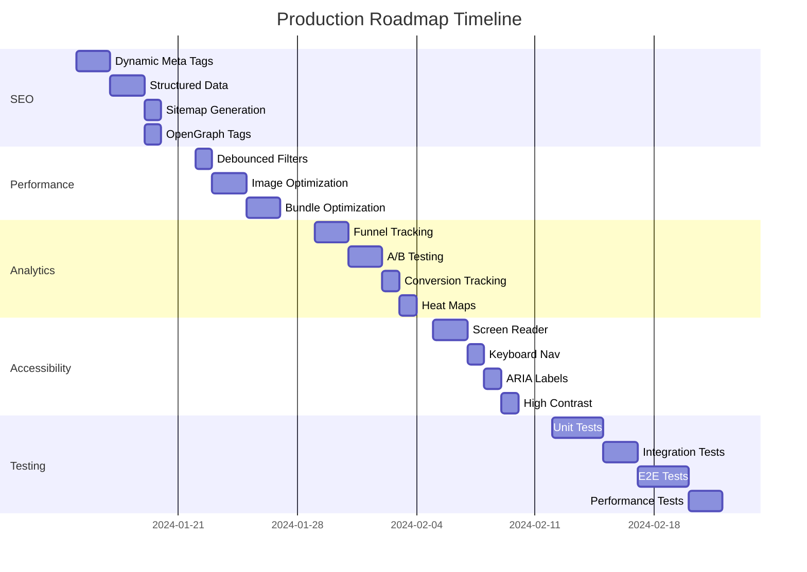

# AI Marketplace Production Roadmap

## 📋 Implementation Status & Priorities

### ✅ Completed Features
- Service catalog with advanced filtering
- Semantic search with OpenAI embeddings
- Comprehensive RBAC system with 20+ roles
- Enhanced catalog UI with ecommerce-style filters
- Price histogram and visual filters
- Category-aware search
- Filter persistence
- Dynamic role selection from Firestore

### 🚀 High Priority - Production Essentials

#### 1. SEO Optimization (Critical for Discoverability)
**Priority: HIGH | Timeline: 1 week**

- [ ] **Dynamic Meta Tags** - Update based on filters/search
  - Title: "AI Services for {category} - {filters} | AI Marketplace"
  - Description: Dynamic based on active filters
  - Canonical URLs for filter combinations
  
- [ ] **Structured Data Markup** (Schema.org)
  ```json
  {
    "@type": "Service",
    "name": "Service Name",
    "provider": { "@type": "Organization" },
    "aggregateRating": {},
    "offers": { "@type": "Offer" }
  }
  ```

- [ ] **Sitemap Generation**
  - Dynamic sitemap for all service pages
  - Category pages sitemap
  - Provider profile sitemaps
  
- [ ] **OpenGraph Tags**
  - Service preview cards for social sharing
  - Dynamic images based on service
  - Twitter Card support

#### 2. Performance Optimizations
**Priority: HIGH | Timeline: 3-4 days**

- [ ] **Debounced Filtering** (Already partially done)
  - Extend to all filter types
  - Optimize query batching
  
- [ ] **Image Optimization**
  - Next.js Image component everywhere
  - Blur placeholders
  - WebP format with fallbacks
  - CDN integration
  
- [ ] **Bundle Optimization**
  - Code splitting per route
  - Dynamic imports for heavy components
  - Tree shaking audit
  - Analyze with @next/bundle-analyzer

#### 3. Analytics Enhancement
**Priority: MEDIUM-HIGH | Timeline: 1 week**

- [ ] **Funnel Tracking**
  ```typescript
  // Track: Homepage → Search → Filter → View → Contact
  analytics.track('funnel_step', {
    step: 'filter_applied',
    filters: activeFilters,
    results_count: results.length
  });
  ```

- [ ] **A/B Testing Framework**
  - Use Vercel Edge Config or Optimizely
  - Test filter layouts
  - Test search suggestions
  
- [ ] **Conversion Tracking**
  - Contact provider events
  - Save service events
  - Filter effectiveness metrics
  
- [ ] **Heat Maps**
  - Integrate Hotjar or FullStory
  - Track filter usage patterns
  - Identify drop-off points

### 🎯 Medium Priority - User Experience

#### 4. Accessibility Improvements
**Priority: MEDIUM | Timeline: 1 week**

- [ ] **Screen Reader Support**
  - Proper heading hierarchy
  - Live regions for filter updates
  - Skip navigation links
  
- [ ] **Keyboard Navigation**
  - Tab order optimization
  - Focus management
  - Keyboard shortcuts (/)
  
- [ ] **ARIA Labels**
  ```tsx
  aria-label="Filter services by price range"
  aria-describedby="price-filter-description"
  role="group"
  ```
  
- [ ] **High Contrast Mode**
  - CSS custom properties for theming
  - Respect prefers-contrast media query
  - Test with Windows High Contrast

#### 5. Testing & Quality Assurance
**Priority: MEDIUM | Timeline: 1-2 weeks**

- [ ] **Unit Tests** (Jest/Vitest)
  - Filter logic tests
  - Price calculation tests
  - Search algorithm tests
  
- [ ] **Integration Tests**
  - API endpoint testing
  - Database query testing
  - Authentication flow tests
  
- [ ] **E2E Tests** (Playwright)
  ```typescript
  test('user can filter services', async ({ page }) => {
    await page.goto('/catalog');
    await page.click('[data-testid="category-filter"]');
    await page.click('text=Machine Learning');
    await expect(page).toHaveURL(/category=machine-learning/);
  });
  ```
  
- [ ] **Performance Tests**
  - Load testing with k6
  - Lighthouse CI in pipeline
  - Core Web Vitals monitoring

### 🔮 Future Enhancements - Advanced Features

#### 6. Advanced Features
**Priority: LOW | Timeline: Future Sprints**

- [ ] **Saved Searches**
  - User preferences in Firestore
  - Email alerts for new matches
  - Search history
  
- [ ] **Smart Recommendations**
  - Collaborative filtering
  - Content-based recommendations
  - ML-powered suggestions
  
- [ ] **AI Service Matching**
  - Natural language requirements
  - Auto-match to services
  - Confidence scoring

### 📊 Implementation Order



### 🎯 Quick Wins (Can do immediately)

1. **Add robots.txt and sitemap.xml**
2. **Implement basic meta tags**
3. **Add Google Analytics**
4. **Enable Vercel Analytics**
5. **Add loading skeletons everywhere**

### 📈 Success Metrics

- **SEO**: Organic traffic +50% in 3 months
- **Performance**: Core Web Vitals all green
- **Analytics**: <2% bounce rate on catalog
- **Accessibility**: WCAG 2.1 AA compliance
- **Testing**: >80% code coverage

### 🛠️ Technical Debt to Address

1. TypeScript strict mode everywhere
2. Error boundary components
3. Proper error logging (Sentry)
4. API rate limiting
5. Database query optimization
6. Caching strategy (Redis)

### 📝 Next Steps

1. **Immediate**: Start with SEO meta tags (highest ROI)
2. **This Week**: Performance optimizations
3. **Next Week**: Analytics and tracking
4. **Following Week**: Accessibility and testing

Would you like me to start implementing any of these features? I recommend beginning with the SEO optimizations as they'll have the biggest impact on discoverability and user acquisition.